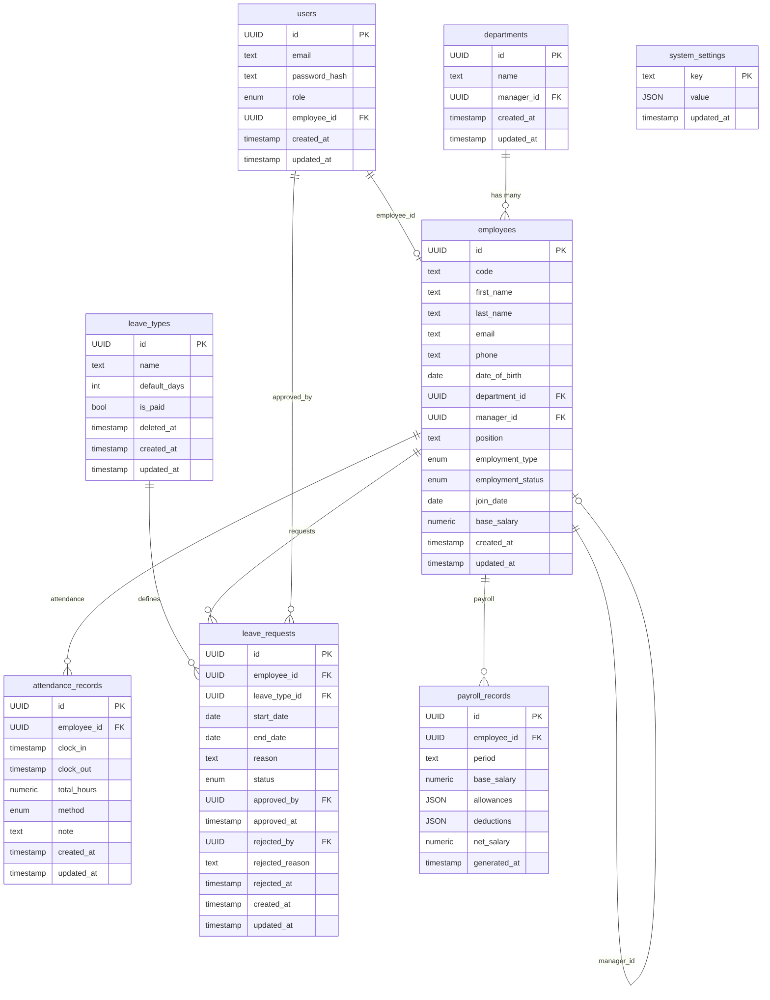

```mermaid
erDiagram

  users ||--o| employees : "employee_id"
  users {
    UUID id PK
    text email
    text password_hash
    enum role
    UUID employee_id FK
    timestamp created_at
    timestamp updated_at
  }

  departments ||--o{ employees : "has many"
  employees ||--o| employees : "manager_id"
  employees {
    UUID id PK
    text code
    text first_name
    text last_name
    text email
    text phone
    date date_of_birth
    UUID department_id FK
    UUID manager_id FK
    text position
    enum employment_type
    enum employment_status
    date join_date
    numeric base_salary
    timestamp created_at
    timestamp updated_at
  }

  departments {
    UUID id PK
    text name
    UUID manager_id FK
    timestamp created_at
    timestamp updated_at
  }

  employees ||--o{ attendance_records : "attendance"
  attendance_records {
    UUID id PK
    UUID employee_id FK
    timestamp clock_in
    timestamp clock_out
    numeric total_hours
    enum method
    text note
    timestamp created_at
    timestamp updated_at
  }

  leave_types ||--o{ leave_requests : "defines"
  employees ||--o{ leave_requests : "requests"
  users ||--o{ leave_requests : "approved_by"

  leave_types {
    UUID id PK
    text name
    int default_days
    bool is_paid
    timestamp deleted_at
    timestamp created_at
    timestamp updated_at
  }

  leave_requests {
    UUID id PK
    UUID employee_id FK
    UUID leave_type_id FK
    date start_date
    date end_date
    text reason
    enum status
    UUID approved_by FK
    timestamp approved_at
    UUID rejected_by FK
    text rejected_reason
    timestamp rejected_at
    timestamp created_at
    timestamp updated_at
  }

  employees ||--o{ payroll_records : "payroll"
  payroll_records {
    UUID id PK
    UUID employee_id FK
    text period
    numeric base_salary
    JSON allowances
    JSON deductions
    numeric net_salary
    timestamp generated_at
  }

  system_settings {
    text key PK
    JSON value
    timestamp updated_at
  }
```